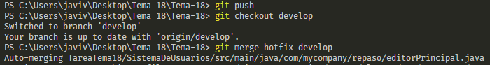

# Tarea Tema 18 - Entornos de desarrollo
## Comandos GIT utilizados:

### *git branch {nombre}*
Con este comando creamos una nueva rama

### *git branch -m {nombre rama} {nuevo nombre}*
Con este comando renombramos una rama existente

### *git branch*
Con este comando podemos observar las ramas disponibles

### *git checkout {nombre}*
Con este comando podemos cambiar de rama

### *git merge {ramaOrigen} {ramaDestino}*
Con este comando fusionamos los cambios de una rama de origen con otro rama destino.

## Problemas al realizar la fusión de ramas

Al tratar de realizar una fusión entre archivos que han sido modificados independientemente obtenemos un error, para el que deberemos resolver esos conflictos antes de continuar.

El editor nos muestra las porciones de código que son diferentes en cada archivo, donde nosotros deberemos de elegir qué cambios queremos conservar para poder fusionar los archivos.